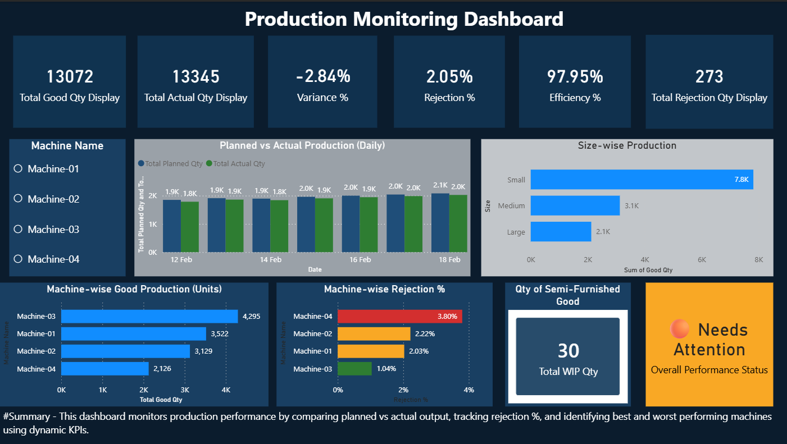
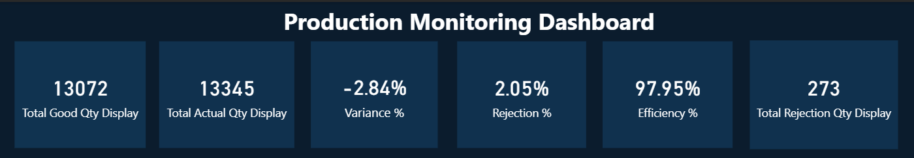
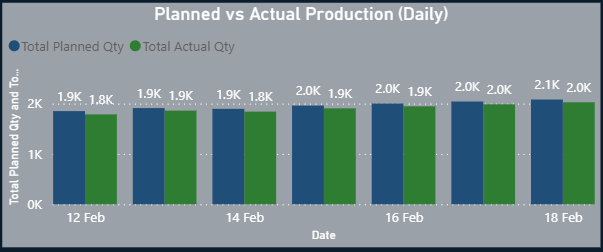
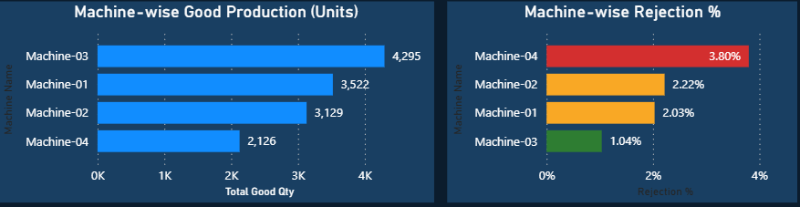
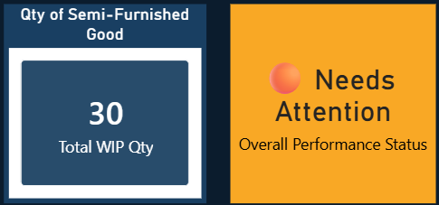

# 🏭 Production Monitoring Dashboard

> ⚡ This dashboard uses DAX measures to dynamically calculate **Efficiency %**, **Rejection %**, and **Production Variance** based on user-selected filters.

---

## 📌 Project Overview

The **Production Monitoring Dashboard** is an interactive Power BI solution designed to monitor and analyze manufacturing performance.

It compares planned vs actual production, tracks rejection rates, measures operational efficiency, and identifies machine-level performance issues to support data-driven decision-making in a production environment.

The dataset was cleaned and prepared using Microsoft Excel before being modeled and visualized in Power BI.

---

## 🎯 Business Objectives

- Monitor daily production output
- Compare Planned vs Actual production performance
- Track machine-wise rejection percentage
- Measure overall production efficiency
- Identify machines requiring attention
- Support operational performance improvement

---

## 🛠️ Tools & Technologies Used

- Microsoft Excel (Data Cleaning & Preparation)
- Power BI (Data Modeling & Visualization)
- DAX (Data Analysis Expressions)

---

## 📂 Project Structure

### 📊 Dashboard File

dashboard/Production_Monitoring_Dashboard.pbix

This Power BI file contains:

- Interactive KPI Cards
- Planned vs Actual Production Trend
- Machine-wise Production Analysis
- Rejection % Tracking
- Efficiency % Monitoring
- Performance Status Indicator

Open this file using **Power BI Desktop** to explore full interactivity.

---

### 📁 Dataset File

data/cleaned_production_data.xlsx

### Data Preparation Performed in Excel:

- Removed duplicate records
- Handled missing values
- Standardized date formats
- Structured dataset for reporting
- Prepared data for Power BI modeling

This dataset serves as the primary data source for the dashboard.

---

## 🧮 DAX Measures Implemented

The following DAX measures were created for dynamic KPI calculations:

- Efficiency %
- Rejection %
- Variance %
- Production Variance

### Example DAX Logic:

```DAX
Efficiency % = DIVIDE([Good Qty], [Actual Qty])

Rejection % = DIVIDE([Rejection Qty], [Actual Qty])

Variance % = DIVIDE([Actual Qty] - [Planned Qty], [Planned Qty])

These measures dynamically update based on selected filters such as Machine, Date, and Shift.

---

## 📈 Key Performance Indicators (KPIs)

- Total Good Quantity
- Total Actual Quantity
- Variance %
- Rejection %
- Efficiency %
- Total Rejection Quantity
- Work-in-Progress (WIP) Quantity
- Performance Status Indicator

---

## 📊 Dashboard Features

- Planned vs Actual Production Comparison
- Machine-wise Good Production Analysis
- Machine-wise Rejection %
- Size-wise Production Breakdown
- Performance Status (Needs Attention / Performing Well)
- Interactive Filters (Machine, Date, Shift)

---

## 🖼️ Dashboard Preview

### Full Overview


### KPI Section


### Planned vs Actual Production


### Machine Analysis


### Performance Status


---

## 🚀 How to Use

1. Download the file:
   dashboard/Production_Monitoring_Dashboard.pbix
2. Open it in Power BI Desktop.
3. Use filters and slicers to explore production insights dynamically.

---

## 📌 Future Enhancements

- Add predictive maintenance analysis
- Implement production forecasting
- Add drill-through detailed reports
- Connect to real-time production database
- Automate data refresh process

---

## 👨‍💻 Author

M Venkateshwar Rao  
Aspiring Data Analyst | Power BI | Excel | DAX | SQL  
🔗 GitHub: https://github.com/raodesk1217-decoder
